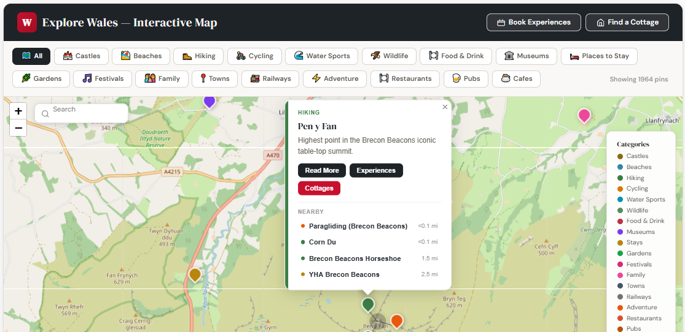

# Wales Interactive Map 🗺️🏴󠁧󠁢󠁷󠁬󠁳󠁿

> An open-source, high-performance interactive map of Wales — **1,963 filterable pins across 19 categories**, with marker clustering, universal search, rich popups, and an embeddable iframe. Built for [wales.org](https://wales.org), the comprehensive travel guide to Wales.

[](https://wales.org/interactive-map-wales/)
[](LICENSE)


**🔗 Live demo:** [wales.org/interactive-map-wales](https://wales.org/interactive-map-wales/)
**📦 Free embed:** [Skip to the iframe snippet](#-embed-on-your-own-site-30-seconds)



---

## Why we open-sourced this

We built this because nothing like it existed for Wales — and we got tired of waiting.

Most "maps of Wales" online are printable PDFs, Google My Maps with 30 pins, or paywalled tourism-board widgets that won't let you customise anything. Welsh tourism is a **£6bn+ industry** and the web infrastructure around it should be as open as the trails.

So we shipped:

- A **free embeddable map** any travel blog, DMO, or cottage-operator site can drop in (one block of HTML — see below)
- The **full codebase** so anyone can fork it and adapt the architecture for Cornwall, the Highlands, the Lake District, or anywhere else
- The **pin dataset** as version-controlled JS, so contributors can submit corrections, accessibility info and hidden gems via PR

If this saves another regional travel site a year of dev work, it was worth open-sourcing.

---

## What it does

A fully interactive map of Wales featuring **1,963 location pins** across **19 categories** — from castles and beaches to restaurants, campsites, dog-friendly walks and heritage railways. Every pin opens a rich popup card with description, star rating, link to the full Wales.org guide, and (optional) booking link, plus 2–3 "nearby" suggestions that chain users from pin to pin.

### Features

- 🗺️ **1,963 pins across 19 filterable categories** — Castles, Beaches, Walks, Towns, Food & Drink, Wildlife, Activities, Accommodation, Camping, Heritage Railways, Gardens, Museums, Waterfalls, Dog-Friendly, and more
- 🎛️ **Multi-select category filters** — toggle multiple categories simultaneously, with pin counts updating in real time
- 🔍 **Universal search** — search all pins by name, region, town, city, or venue. Typing *"Anglesey"* zooms to show all pins in that area; clicking a result opens its popup
- 💬 **Rich popup cards** — name, category badge, description, Google rating (where available), link to the full Wales.org guide, and optional booking buttons
- 🔗 **"Nearby" suggestions** — every popup shows 2–3 nearby pins from different categories, creating a natural exploration chain
- 🎯 **Marker clustering** — Leaflet.markercluster groups dense pin areas at low zoom, expanding smoothly as users zoom in
- 📱 **Mobile responsive** — touch-optimised popup sizing and adaptive filter layout
- ⚡ **Fast** — all pin data is static JS, no API calls or database queries. Optimised for performance with marker clustering and lazy-loaded popups.
- 🔌 **WordPress-ready** — runs inside a Gutenberg Custom HTML block, no plugin needed
- 🌐 **Standalone-ready** — works as a static HTML page on any web server

---

## 📦 Embed on your own site (30 seconds)

The fastest way to use this map: paste this into any HTML editor, WordPress Custom HTML block, Squarespace code block, or website builder.

```html
<iframe
  src="https://wales.org/wales-org-map-embed/"
  width="100%"
  height="600"
  style="border: 1px solid #e2e8f0; border-radius: 8px;"
  title="Interactive Map of Wales"
  loading="lazy"
  allowfullscreen>
</iframe>
<p style="text-align:center; font-size:14px; margin-top:8px; font-family:sans-serif;">
  Powered by the
  <a href="https://wales.org/interactive-map-wales/" target="_blank" rel="noopener">Interactive Map of Wales</a>
  from Wales.org
</p>
```

You'll get all 1,963 pins, all 19 filters, fully responsive — free to use with attribution.

---

## 🛠️ Self-host the map

If you want to run the map on your own infrastructure, customise the styling, or fork it for a different region, here's the full install.

### File structure

```
wales-interactive-map/
├── .gitignore                    # Files Git should ignore (node_modules, .env, etc.)
├── wales-map-app.js              # All map logic — init, filters, search, popups, nearby (40KB)
├── wales-map-style.css           # All styles — filters, popups, search, responsive (6KB)
├── wales-venues.js               # 664 Google Places venue pins (83KB)
├── wales-extra-pins-verified.js  # 1,132 additional verified pins
├── Wales-Interactive-Map.png     # README screenshot
├── README.md
└── LICENSE
```

### Architecture

The map is built with three data layers:

1. **170 handcrafted pins** — curated locations from Wales.org with custom descriptions, guide links, and affiliate URLs
2. **664 Google Places venues** — restaurants, cafés, pubs and attractions with Google ratings and review counts
3. **1,132 Google-verified extra pins** — additional points of interest verified via the Google Places API for accuracy

All data is loaded client-side as static JS files — no server-side API calls, no database queries, no latency.

### WordPress install

1. Upload the JS and CSS files to your theme directory (e.g. `wp-content/themes/your-child-theme/`).

2. Create a page with a Custom HTML block containing:

   ```html
   <div id="wales-map-container"></div>
   <script src="/wp-content/themes/your-child-theme/wales-venues.js?v=12"></script>
   <script src="/wp-content/themes/your-child-theme/wales-extra-pins-verified.js?v=12"></script>
   <script src="/wp-content/themes/your-child-theme/wales-map-app.js?v=12"></script>
   ```

3. Add Leaflet and MarkerCluster to your site header (via WPCode or similar):

   ```html
   <link rel="stylesheet" href="https://unpkg.com/leaflet@1.9.4/dist/leaflet.css" />
   <script src="https://unpkg.com/leaflet@1.9.4/dist/leaflet.js"></script>
   <link rel="stylesheet" href="https://unpkg.com/leaflet.markercluster@1.5.3/dist/MarkerCluster.css" />
   <link rel="stylesheet" href="https://unpkg.com/leaflet.markercluster@1.5.3/dist/MarkerCluster.Default.css" />
   <script src="https://unpkg.com/leaflet.markercluster@1.5.3/dist/leaflet.markercluster.js"></script>
   ```

4. If using Perfmatters or a similar JS-delay plugin, exclude the Leaflet and map scripts from delay.

### Standalone HTML install

Wrap the container `<div>` and script tags in a standard HTML document and serve from any web server. No backend required.

### Performance notes

- All pin data is static JS — no API calls on page load
- MarkerCluster handles rendering performance for 1,963 simultaneous pins
- Compatible with LiteSpeed Cache (exclude map scripts from UCSS)
- Compatible with Perfmatters (add script filenames to Delay JS exclude list)
- Built and tested on a full WordPress production stack at wales.org with caching and JS-delay plugins. Compatible with LiteSpeed Cache (exclude map scripts from UCSS) and Perfmatters (add script filenames to Delay JS exclude list).

---

## Customisation

**Adding pins** — Each pin is a JavaScript object with `name`, `lat`, `lng`, `cat` (category), `desc`, `url` (guide link) and optional `affiliate` (booking link) properties. Add new objects to the appropriate data file:

```js
{
  name: "Conwy Castle",
  lat: 53.2806,
  lng: -3.8252,
  cat: "castles",
  desc: "13th-century UNESCO World Heritage fortress…",
  url: "https://wales.org/things-to-do-in-wales/attractions/castles/",
  affiliate: "https://www.viator.com/…"
}
```

**Adding categories** — Categories are defined in the filter configuration at the top of `wales-map-app.js`. Each has a name, icon, colour, and filter button.

**Changing affiliate links** — Base URLs are defined as variables at the top of `wales-map-app.js`. Replace with your own tracking parameters.

**Forking for another region** — The architecture is location-agnostic. Swap the pin data files and update the initial map centre/zoom in `wales-map-app.js` and you've got an interactive map of Cornwall, Devon, the Scottish Highlands, Provence, Tuscany — wherever.

---

## Use cases

- **Tourism boards / DMOs** wanting an embeddable regional map without building from scratch
- **Travel bloggers** who want a richer "places to visit" page than Google My Maps allows
- **Holiday-let and cottage operators** displaying nearby attractions on listing pages
- **Hospitality/tourism courses** as a real-world open dataset
- **Forks for other regions** — if you adapt this for somewhere else, [open an issue](https://github.com/walesorg/wales-interactive-map/issues) so we can feature it

---

## Contributing

Pull requests very welcome — especially for:

- 📍 **New pins** — hidden gems, recently opened venues, places we missed
- ✏️ **Corrections** — wrong coordinates, outdated info, closed venues
- ♿ **Accessibility data** — wheelchair access, dog-friendly status, parking info
- 🏴󠁧󠁢󠁷󠁬󠁳󠁿 **Welsh translations** — Cymraeg location names and descriptions
- 🐛 **Bug fixes** — anything broken, anything weird

Spotted something but don't want to PR? [Open an issue](https://github.com/walesorg/wales-interactive-map/issues/new) — takes 30 seconds.

If you fork this for a different region, please drop us a line at [nicholas@wales.org](mailto:nicholas@wales.org) — we'd love to feature regional forks.

---

## License

Released under the **MIT License** — see [LICENSE](LICENSE) for details. You're free to use, modify and redistribute this code, including in commercial and proprietary projects. The only requirement is keeping the copyright notice.

---

## About

Built and maintained by [**Nicholas Barrett**](https://wales.org/author/nicholas-barrett/) and the [Wales.org](https://wales.org) team.

Pembrokeshire-born travel writer and founder of Wales.org. Born in Haverfordwest, now based in Hertfordshire — covering Welsh castles, national parks, festivals and family staycations across all 22 Welsh counties.

Pin data curated from local knowledge, OpenStreetMap, Cadw, Visit Wales and contributor submissions. Map tiles © OpenStreetMap contributors.

### Stay connected

- 🌐 **Website:** [wales.org](https://wales.org)
- 📧 **Email:** [nicholas@wales.org](mailto:nicholas@wales.org)
- 💼 **LinkedIn:** [Nicholas Barrett](https://www.linkedin.com/in/nicholas-barrett-wales/)
- 📰 **Newsletter:** [Discover Wales on Substack](https://discoverwales.substack.com/)

If this project is useful to you, the kindest thing you can do is **⭐ star the repo** — it helps other travel-tech builders discover it.

---

*Croeso i Gymru. 🏴󠁧󠁢󠁷󠁬󠁳󠁿*
